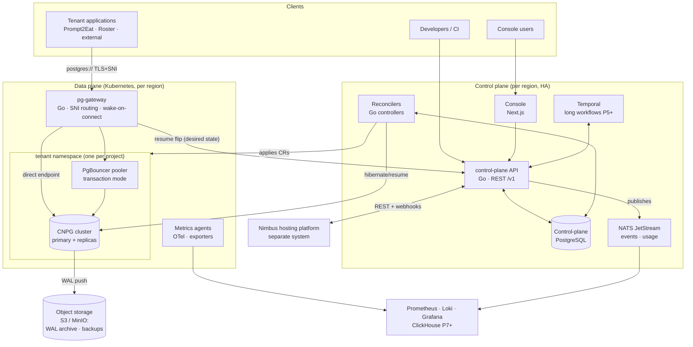

# System Architecture — NimbusDB

**Status:** Draft v0.1 · **Companion docs:** [DATABASE_ARCHITECTURE.md](DATABASE_ARCHITECTURE.md), [MULTI_TENANCY.md](MULTI_TENANCY.md), [DEPLOYMENT_ARCHITECTURE.md](DEPLOYMENT_ARCHITECTURE.md)

---

## 1. Design principles

1. **Control plane / data plane separation.** The control plane (API, console, reconcilers,
   billing) never sits on the customer's query path. If every control-plane component is down,
   existing tenant databases keep serving traffic through the gateway.
2. **Desired-state reconciliation.** The control-plane database holds desired state; reconcilers
   converge Kubernetes (CNPG resources, poolers, network policies) toward it and write observed
   status back. Crash-safe, idempotent, resumable — the same idiom Kubernetes itself uses, and
   the same seam (`DeploymentDriver`) the Nimbus codebase already established.
3. **Boring data path, custom control logic.** PostgreSQL, CloudNativePG, PgBouncer, Barman
   (WAL archiving) hold customer bytes. Our own code decides *when and how* to run them.
4. **Loosely coupled to Nimbus.** Integration is contract-based (REST + webhooks + env-var
   injection). Neither platform holds foreign keys into the other; links are soft references
   (IDs + URLs) that can be detached (see §7).

---

## 2. Component overview



### 2.1 Control plane components

| Component | Language / tech | Responsibility |
|---|---|---|
| **control-plane API** | Go, REST (OpenAPI 3.1), chi router | Public `/v1` API: orgs, projects, branches, endpoints, roles, backups, restores, imports, API keys, usage, audit. AuthN/Z, rate limiting, input validation. Stateless, horizontally scaled. |
| **Reconcilers** | Go, controller-runtime client | Converge desired state → CNPG `Cluster`/`Pooler`/`ScheduledBackup` CRs, namespaces, NetworkPolicies, certificates, gateway route table. Watch status back into control-plane DB. |
| **Control-plane DB** | PostgreSQL 17 (CNPG, 3-node HA) | Source of truth: tenancy, desired/observed state, secrets (envelope-encrypted), audit log, usage aggregates (until ClickHouse). |
| **NATS JetStream** | NATS 2.x | Platform event bus: state transitions, usage samples, audit fan-out, webhook delivery queue. At-least-once, replayable streams. |
| **Temporal** (Phase 5+) | Temporal OSS, Go SDK | Durable long-running workflows: migration imports, large restores, multi-step cutovers. Not used for basic provisioning (reconcilers own that). |
| **Console** | Next.js 15+, React 19, Tailwind v4 | Web UI. Talks only to the public API with the user's session. Contains SQL editor, dashboards, admin portal. |

### 2.2 Data plane components

| Component | Tech | Responsibility |
|---|---|---|
| **Kubernetes** | k8s ≥1.31 | Substrate for all tenant workloads and platform services. |
| **CloudNativePG (CNPG)** | v1.25+ operator | Tenant Postgres lifecycle: HA (streaming replication + automated failover), rolling updates, backups via Barman Cloud plugin, volume snapshots, hibernation. |
| **PgBouncer** | via CNPG `Pooler` CR | Per-branch pooled endpoint, transaction mode. Session-mode semantics are served by the direct endpoint (see DATABASE_ARCHITECTURE §5). |
| **pg-gateway** | Go (custom; ~the one custom data-path component) | Terminates Postgres TLS, routes by SNI (`<endpoint-id>.<region>.db.nimbus.app`) to the right pooler/cluster service, holds connections while waking suspended computes, enforces per-endpoint connection limits, emits per-connection usage events. |
| **Cilium** | CNI + NetworkPolicy | Default-deny east-west; only gateway → pooler/cluster paths allowed into tenant namespaces. |
| **Traefik** | Ingress | HTTP(S) ingress for API + console only. Postgres TCP traffic goes through pg-gateway, not Traefik (ADR-007). |
| **Object storage** | S3-compatible (cloud S3 or MinIO) | WAL archive, base backups, branch snapshots export, import staging. Bucket-per-region, prefix-per-project. |
| **Observability agents** | OTel collector, CNPG metrics exporter, Loki promtail | Metrics/logs/traces off the cluster into the monitoring stack. |

---

## 3. Key flows

### 3.1 Provisioning a project (Phase 2)

1. `POST /v1/projects` — API validates, writes `projects` + default branch `main` + desired
   state rows (`compute_state = running`), returns 201 with connection info (pending).
2. Reconciler picks up desired state: creates namespace `prj-<id>`, quotas, NetworkPolicies,
   CNPG `Cluster` (1–3 instances per plan), `Pooler`, TLS cert, `ScheduledBackup`; registers
   endpoint IDs in the gateway route table (a small watched config the gateway consumes).
3. CNPG reports cluster healthy → reconciler writes observed state → endpoint status becomes
   `ready`; NATS event `project.provisioned` → console updates live; connection strings become
   fetchable.

Target: **< 60 s** from API call to accepting connections (Gen 1).

### 3.2 Connection path (steady state)

```
app → TLS+SNI: ep-abc123.syd1.db.nimbus.app:5432 → pg-gateway
    → (pooled endpoint) namespace prj-x / pgbouncer → postgres primary
    → (direct endpoint) namespace prj-x / cluster-rw service → postgres primary
    → (read endpoint)   namespace prj-x / cluster-ro service → replicas
```

The gateway is a transparent byte-pipe after routing (no protocol rewriting in Gen 1); latency
budget ≤ 1 ms added in-region.

### 3.3 Wake-on-connect (Phase 4)

The trigger is a **desired-state flip on the branch**, not an imperative RPC (ADR-014). Suspend and
wake are transitional states (`suspending`, `resuming`) the reconciler converges, exactly like
provisioning/teardown — so a wake survives a reconciler restart.

1. **Suspend (idle):** every gateway reports its per-branch active-connection counts to the control
   plane, which **aggregates across all replicas** and — fail-safe, only while reporting is live —
   flips a branch `ready → suspending` once its global active count is zero and it has been idle past
   its `suspend_timeout` (default 5 min, per-plan; ADR-015). The reconciler then applies CNPG
   hibernation (Postgres shut down cleanly; PVCs retained) and scales the pooler to zero, then marks
   it `suspended`. Endpoints move in lockstep; the route stays published (marked `suspended`) so the
   gateway can still hold and wake a connecting client.
2. **Wake (on connect):** a new connection arrives at the gateway → the route entry is `suspended`
   → the gateway holds the TCP connection (client sees normal connect latency) and calls the
   control-plane API's **resume** action, which flips `suspended → resuming`. The call is
   **coalesced per branch** (idempotent flip), so a connection storm triggers one wake.
3. **Resume:** the reconciler observes `resuming`, un-hibernates the cluster **and scales the
   pooler back up**; once the cluster reports `ready` it marks the branch `ready`, the route flips
   to `ready`, and the gateway completes the held backend connection.
4. Gen 1 cold-start target: **p50 < 10 s, p95 < 25 s** (documented honestly to tenants; most
   drivers' default `connect_timeout` needs ≥ 30 s guidance) — hitting p95 needs the reconciler to
   observe the `resuming` flip promptly (short interval / event-driven). Gen 2 (Neon storage engine
   evaluation) targets sub-second. ADR-004, ADR-014.

The same resume flip serves the human **`POST /branches/{br}/resume`** API call, the gateway's
on-connect wake, and Nimbus's deploy-time prewarm ping (R-3) — one path, one idempotency.

### 3.4 Branching (Phase 4)

`POST /v1/projects/{id}/branches` with `{ from: "main", at: "<timestamp|lsn|now>" }` →
reconciler takes/uses a CSI `VolumeSnapshot` (or restores base backup + replays WAL to the
requested point) → new CNPG cluster from that volume → new endpoints. Storage is CoW where the
CSI driver supports it. Detail in DATABASE_ARCHITECTURE §6.

### 3.5 Usage metering

Gateway (connection-seconds, bytes in/out), CNPG exporter (compute-seconds by size, storage
bytes), and control plane (branch counts, backup storage) publish samples → NATS JetStream →
metering consumer aggregates into hourly rollups in the control-plane DB (ClickHouse from
Phase 7) → billing engine rates them against plans (Phase 7). Nothing on the query path blocks
on metering.

---

## 4. Technology choices and justification

Full alternatives analysis in [DECISION_LOG.md](DECISION_LOG.md); summary:

| Choice | Why | Rejected alternatives |
|---|---|---|
| **Go for control plane & gateway** (ADR-002) | Kubernetes ecosystem is Go-native (controller-runtime, client-go, CNPG itself); static binaries; goroutine model fits reconcilers and proxies; the team ships faster in Go than Rust for CRUD+controller code; industry precedent (Neon control plane, most operators). | Rust (kept as option for Gen-2 data-path components; higher cost for CRUD velocity), TypeScript (weak k8s controller story, would couple us to Node on the data path). |
| **PostgreSQL for control plane** | Dogfooding; one operational skill set; transactional desired-state + audit in one place. | etcd-style stores (no relational queries), SQLite (no HA). |
| **Kubernetes + CloudNativePG** (ADR-003) | CNPG is the most active, k8s-native PG operator: streaming-replication HA, automated failover, Barman-based PITR, volume snapshots, hibernation, `Pooler` CR — exactly our Gen-1 feature list, maintained upstream. | Patroni+Spilo/Zalando operator (older CRD ergonomics), StackGres, KubeDB (licensing), hand-rolled systemd/VM fleet (rebuilds the world), Firecracker microVMs (Gen-2 consideration, not needed for correctness). |
| **PgBouncer (via CNPG Pooler)** | Battle-tested, transaction pooling, tiny footprint, first-class CNPG integration. | PgCat (attractive Rust multi-pool router — revisit for Gen 2 sharded pooling), Odyssey (less maintained), Supavisor (Elixir, adds a runtime). |
| **Custom pg-gateway** (ADR-007) | Need Postgres-aware SNI routing **plus wake-on-connect hold** and per-endpoint metering; no off-the-shelf proxy does the wake semantics. Traefik v3 can route Postgres STARTTLS by SNI but cannot hold-and-wake. Scope is deliberately small: route, hold, count. | Traefik TCP (no wake), HAProxy (no wake), per-tenant LoadBalancer Services (cost/IP explosion), Neon proxy (couples us to Neon protocol internals before Gen 2). |
| **NATS JetStream** | Lightweight, k8s-friendly eventing + work queues with replay; one binary; fits usage metering and webhook delivery. | Kafka (operational heavyweight at our scale), Redis streams (weaker durability story), Postgres LISTEN/NOTIFY (fine intra-service, not a bus). |
| **Temporal (Phase 5+)** | Migration imports and cutovers are long, multi-step, retry-heavy, human-approvable workflows — Temporal's exact sweet spot. Introduced only when that need arrives; provisioning stays in reconcilers. | Building a saga framework on NATS (reinvention), k8s Jobs + state machine (fine until retries/compensation get complex). |
| **OpenTelemetry + Prometheus + Loki + Grafana** | Standard, self-hostable, CNPG ships Prometheus metrics natively. | Vendor APM (cost, data residency). |
| **ClickHouse (Phase 7)** | Usage events and query-insight facts are append-heavy, aggregated-by-time — columnar wins; keeps control-plane PG lean. Deferred until volume justifies it; Postgres rollups until then. | TimescaleDB (keeps load on control-plane PG), DuckDB (single-node). |
| **Cilium, Traefik, ArgoCD, GitHub Actions, Terraform** | See DEPLOYMENT_ARCHITECTURE.md — standard, well-understood, GitOps-native. | — |
| **Next.js console** | Matches Nimbus and both customer apps (team fluency); server components suit dashboard workloads; deployable on Nimbus later (dogfooding). | SvelteKit/Remix (no advantage worth the split from the existing estate). |

---

## 5. Availability model

- **Tenant databases:** per-plan. Free/dev: 1 instance (restart-based recovery, RPO ≈ 0 via WAL
  archive, RTO minutes). Pro/prod: 2–3 instances, synchronous or quorum-based replication per
  CNPG config, automated failover < 30 s, RPO 0 in-region.
- **Gateway:** ≥ 3 replicas per region behind one L4 LB; stateless (route table is watched
  config); connection draining on deploy.
- **Control plane:** API and reconcilers ≥ 2 replicas; control-plane PG is a 3-node CNPG
  cluster; **data plane survives full control-plane outage** (existing routes cached in gateway;
  only new provisioning/wake is degraded — suspended branches can't wake during a full outage,
  which is why the wake path is the highest-availability tier). Concretely the wake path is
  `gateway → control-plane API → control-plane PG → reconciler` (ADR-014): the gateway can hold a
  connection with everything down, but completing the wake needs the API to accept the resume flip,
  the DB to persist it, and a reconciler to converge it — so those three are what must stay up for
  suspended branches to wake.
- **Region model:** single region `syd1` (ap-southeast-2) at launch — matches Nimbus, Vercel
  `syd1` pinning of both customer apps, and their current Neon region. Multi-region readiness
  (region-scoped control planes, global routing) is designed in now, built in Phase 8.

## 6. Scalability model

- Control plane scales horizontally (stateless API; reconcilers shard by project hash).
- Data plane scales by adding k8s nodes; tenant density managed by requests/limits + quotas;
  large tenants graduate to dedicated node pools ("cells") — see MULTI_TENANCY.md §6.
- The gateway scales horizontally; route table size is O(endpoints), held in memory.
- Object storage is effectively unbounded; per-project prefixes allow lifecycle policies.

## 7. Nimbus integration contract (loose coupling)

Defined here; consumed in Phase 6. Nimbus-side work follows Nimbus's existing extension idioms
(driver interface, env-var injection, activity log, plan quotas).

1. **Provisioning direction (Nimbus → NimbusDB):** Nimbus gains a `DatabaseProvider` client that
   calls `POST /v1/projects` (service-to-service API key, org-scoped). A Nimbus project stores
   only `{ nimbusdb_project_id, endpoint_urls }`.
2. **Env-var injection:** on provision/rotation, Nimbus writes `DATABASE_URL` (pooled) and
   `DATABASE_URL_DIRECT` into its `env_vars` for the linked project — same contract both
   customer apps already consume.
3. **Deploy actions (NimbusDB → Nimbus):** console buttons "Deploy Compute / API / Worker /
   Cron / Frontend" call Nimbus's REST API (`nbt_` token, stored per-org as an integration
   secret) to create/deploy Nimbus projects of the appropriate kind. Today Nimbus models `site`
   and `agent`; worker/cron map to `agent` until Nimbus grows first-class kinds (tracked, R-11).
4. **Attach / detach:** both directions store soft links only. Detach deletes the link records
   and (optionally) removes injected env vars; the database and the workload each keep running
   independently. No cascading deletes across systems, ever.
5. **Webhooks:** NimbusDB emits `project.provisioned`, `endpoint.rotated`, `branch.created`,
   etc. to registered webhook URLs (Nimbus registers one); HMAC-signed, at-least-once via NATS.

---

## 8. What we are explicitly NOT building (Gen 1)

- A bespoke storage engine / page server (adopt-vs-build decision deferred to Phase 8, ADR-004).
- Postgres protocol rewriting, query routing, or sharding in the gateway.
- A general-purpose secrets manager (we integrate, not compete — SECURITY_MODEL §5).
- Multi-region active-active tenant databases.
- The roadmap modules (queues, realtime, vector, …) — designed-for (namespace, event bus,
  billing meters are generic), not built (ROADMAP §4).
